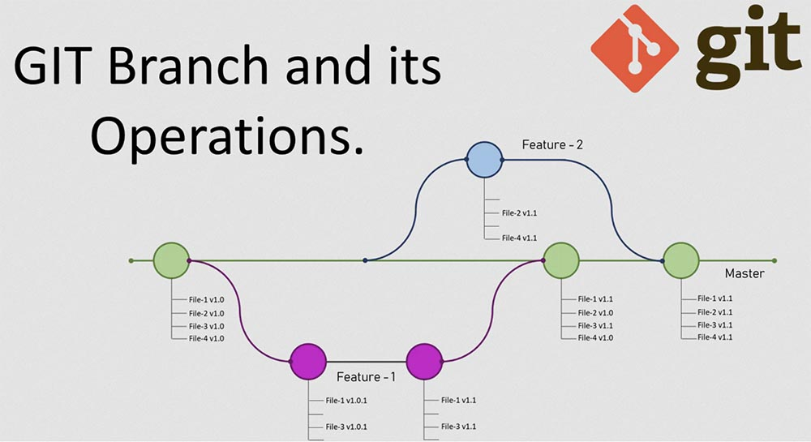

## Работа с ветками
---
**git branch** — список всех локальных веток в текущей директории.

**git branch [branch-name]** — создать новую ветку.

**git checkout [branch-name]** — переключиться на указанную ветку и обновить рабочую директорию.

**git checkout -b <name> <remote>/<branch>** — переключиться на удаленную ветку.

**git checkout [filename]** — вернуть файл в первоначальное состояние если он еще не был добавлен в индекс коммита.

**git merge [branch]** — соединить изменения в текущей ветке с изменениями из заданной.

**git merge --no-ff [branch]** — соединить ветки без режима “fast forwarding”.

**git branch -a** — посмотреть полный список локальных и удаленных веток.

**git branch -d [branch]** — удалить заданную ветку.

**git branch -D [branch]** — принудительно удалить заданную ветку, игнорируя ошибки.

**git branch -m <oldname> <newname>** — переименовать ветку.

---

### [В начало](./readme.md)