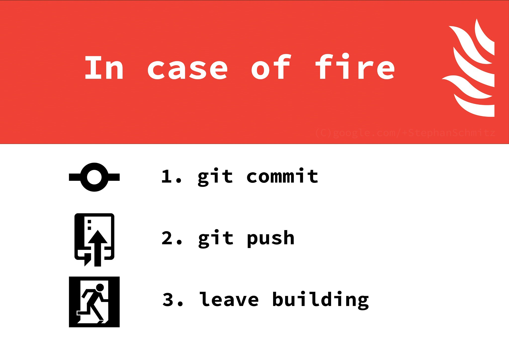

## Синхронизация изменений
---
**git fetch [bookmark]** — загрузить всю историю с заданного удаленного репозитория.

**git merge [bookmark]/[branch]** — слить изменения локальной ветки и заданной удаленной.

**git push** — запушить текущую ветку в удаленную ветку.

**git push [remote] [branch]** — запушить ветку в указанный репозиторий и удаленную ветку.

**git push [bookmark] :[branch]** — в удаленном репозитории удалить заданную ветку.

**git push -u origin master** — если удаленная ветка не установлена как отслеживаемая, то сделать ее такой.

**git pull** — загрузить историю и изменения удаленной ветки и произвести слияние с текущей веткой.

**git pull [remote][branch]** — указать конкретную удаленную ветку для слияния.

**git remote** — посмотреть список доступных удаленных репозиториев.

**git remote -v** — посмотреть детальный список доступных удаленных репозиториев.

**git remote add [remote][url]** — добавить новый удаленный репозиторий.

---

### [В начало](./readme.md)